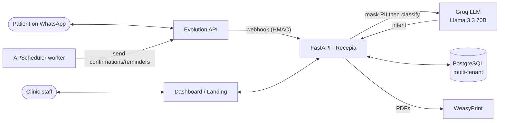

# Recepia — AI-Powered WhatsApp Automation for Clinics

> **Multi-tenant SaaS that turns a clinic's WhatsApp into an AI receptionist** — it confirms, reschedules and books appointments automatically, classifying every patient reply with an LLM and falling back to a deterministic engine when the model is unavailable.

[](https://github.com/Ewertonslv/recepia/actions/workflows/ci.yml)


**🔗 Live demo:** https://recepia.app.br — **test login:** `demo@recepia.app.br` / `demo123456`

> Deployed on Render (free tier) with a Neon PostgreSQL database, served over HTTPS on a custom domain.
> The free instance sleeps when idle, so the first request may take ~50s to wake. The demo account is a
> sandbox — feel free to click around.

---

## Why it matters

Clinics lose money on no-shows and spend hours manually confirming appointments over WhatsApp. **Recepia automates the whole loop:** a scheduled worker sends confirmation/reminder messages, the patient replies in natural language, and an LLM classifies the intent (confirm, cancel, reschedule, **book a new appointment**, opt-out, question) and updates the schedule — per clinic, with strict tenant isolation and LGPD-compliant PII handling.

## Features

- **Multi-tenant by design** — three auth modes (user JWT, clinic API key, master admin key); every query is scoped by `clinica_id`, with isolation covered by automated tests (two clinics, no data bleed).
- **AI intent classification** — Groq / Llama 3.3 70B classifies patient replies; a deterministic regex engine is the automatic fallback, so the bot never goes silent if the LLM is down or rate-limited.
- **WhatsApp integration** via self-hosted [Evolution API](https://github.com/EvolutionAPI/evolution-api) — QR-code pairing, send/receive, per-clinic instances.
- **LGPD / privacy first** — PII (phone, CPF, email, ZIP) is **masked before it ever reaches the LLM** (which runs on US servers); patient data export and message opt-out (LGPD Art. 8 §5) are built in.
- **PDF generation** (WeasyPrint) — medical certificates, attendance declarations, records, receipts, consent forms.
- **Production hardening** — rate limiting (SlowAPI), security headers + HSTS, restricted CORS, non-root Docker image with healthcheck, and **boot-time secret validation** that refuses to start with weak/default keys.
- **Scheduling worker** (APScheduler) — timezone-aware confirmation and reminder windows.

## Architecture



## Tech stack

| Layer | Tech |
|---|---|
| API | FastAPI · Pydantic v2 · Uvicorn |
| Data | PostgreSQL · SQLAlchemy 2.0 · Alembic |
| AI | Groq (Llama 3.3 70B) + regex fallback |
| Messaging | Evolution API (WhatsApp) |
| Auth | JWT (python-jose) · bcrypt · API keys |
| Docs | WeasyPrint + Jinja2 (PDF) |
| Jobs | APScheduler |
| Infra | Docker Compose (api · worker · postgres · evolution) |

## AI pipeline (how a reply becomes an action)

1. Patient sends a free-text WhatsApp message → Evolution delivers it to `/api/webhook/evolution`.
2. **PII is masked** (`mascara_pii`) so phone/CPF/email/ZIP never leave the country in plaintext.
3. The masked text is sent to Groq with a constrained prompt (`temperature=0`, `max_tokens=10`) returning a single category.
4. Intents are mapped with careful ordering (e.g. `OPT_OUT` and `REAGENDAR` are checked before `CANCELADO`/`AGENDAR` to avoid substring collisions).
5. If Groq errors or is rate-limited, a deterministic **regex classifier** takes over — same categories, zero downtime.
6. The schedule is updated and the patient gets the appropriate reply.

## 📊 AI observability

Every classification call is measured — latency, token usage and estimated cost are tracked in-process and exposed at **`GET /api/relatorios/ia`** (authenticated):

```json
{
  "chamadas": 1284,
  "fallbacks_regex": 37,
  "injecoes_bloqueadas": 5,
  "tokens_prompt": 192600,
  "tokens_completion": 12840,
  "latencia_ms_total": 398553.6,
  "custo_usd_total": 0.124,
  "latencia_ms_media": 310.4
}
```

- **Cost & latency are first-class** — you can see exactly what the LLM layer costs and how fast it responds, per process. No guessing the bill.
- **`fallbacks_regex`** counts how often the deterministic classifier took over (Groq down or rate-limited) — the bot never goes silent.
- **`injecoes_bloqueadas`** counts prompt-injection attempts routed straight to the safe deterministic path (OWASP LLM01 guardrail) — the LLM never even sees a crafted message.

## Quickstart (Docker)

```bash
cp .env.example .env
# generate secrets (Git Bash / Linux / macOS):
echo "JWT_SECRET=$(openssl rand -hex 32)"
echo "ADMIN_API_KEY=$(openssl rand -hex 32)"
echo "EVOLUTION_API_KEY=$(openssl rand -hex 32)"
echo "POSTGRES_PASSWORD=$(openssl rand -hex 16)"
# add a free GROQ_API_KEY from https://console.groq.com

docker compose up -d
curl http://localhost:8000/health   # -> {"status":"ok","db":"ok"}
```

Create your first clinic, log in, add a patient and connect WhatsApp — the full step-by-step (including the QR-code flow and triggering confirmations manually) is in **[README.pt-BR.md](README.pt-BR.md)**.

> Boot will **fail fast** if any secret is missing or left as a placeholder — that's intentional.

## Running the tests

```bash
pip install -r requirements.txt pytest
pytest -q          # 109 tests, SQLite in-memory, WhatsApp/LLM mocked — no external services needed
```

CI runs lint (ruff) + the full suite on every push via [GitHub Actions](.github/workflows/ci.yml).

## Key API endpoints

| Method | Route | Purpose |
|---|---|---|
| POST | `/admin/clinicas` | Create a clinic (master admin key) |
| POST | `/auth/login` | User login → JWT (rate-limited 5/min) |
| GET/POST/PUT/DELETE | `/api/pacientes` | Patients CRUD |
| GET | `/api/pacientes/{id}/exportar` | LGPD data export |
| GET/POST/PUT/DELETE | `/api/agendamentos` | Appointments CRUD |
| GET | `/api/agendamentos/{id}/interacoes` | AI conversation log |
| POST | `/api/whatsapp/conectar` | Create instance + QR code |
| POST | `/api/webhook/evolution` | Evolution callback (intent classification) |
| GET | `/api/relatorios/dashboard` | Daily metrics |
| GET | `/health` | Liveness (pings DB) |

## Security & compliance

- Secrets validated at boot (rejects `change-me`, short keys); no insecure defaults.
- Tenant isolation enforced in data access and verified by tests.
- PII masking before any external LLM call; opt-out + data export for LGPD.
- Security headers, HSTS (prod), restricted CORS, SlowAPI rate limiting, non-root container.

## Roadmap

- [ ] Public live demo on AWS (HTTPS + seeded test credentials)
- [ ] Structured LLM output (JSON mode) instead of free-text parsing
- [ ] Cost/latency observability for LLM calls (e.g. Langfuse)
- [ ] Explicit prompt-injection guardrails (OWASP LLM Top 10)

## License

© Ewerton Silva — [github.com/Ewertonslv](https://github.com/Ewertonslv). All rights reserved.
Recepia is a commercial product; the source is public for portfolio/demo purposes and is **not**
licensed for redistribution, resale, or production use by third parties.
